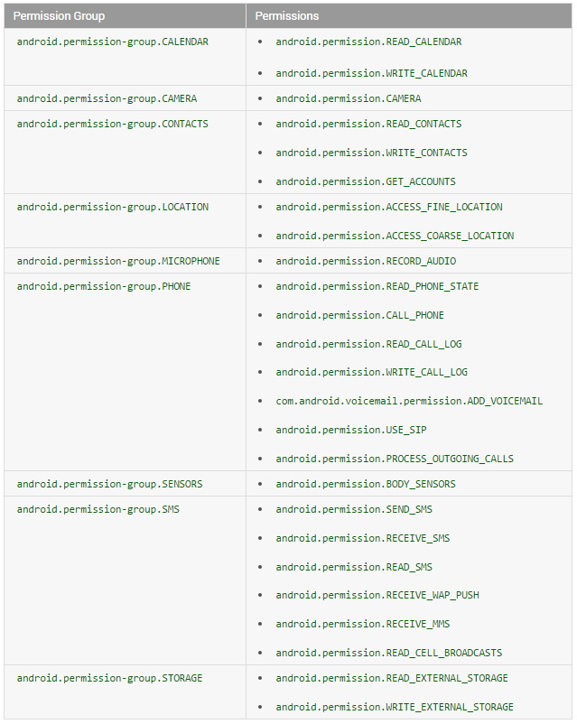
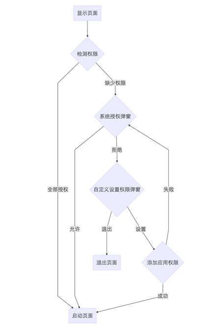
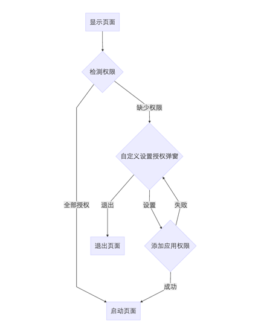

# Android6.0运行时权限

## 1.前言

​        从Android6.0（API23）开始，对系统权限做了很大的改变。在6.0之前只需要把APP所需要的权限在mainfast文件中进行注册，APP安装后都可以访问这些权限。但是由于这种方式很不优雅也不安全。从6.0之后开始，一下敏感的权限，必须在使用的时候动态申请，由用户来决定是否给予该项权限，已经获取的权限，用户也可以去APP设置页面去关闭授权。这样对用户来说更友好，可以防止一些APP的流氓行为，但是对于开发者来说，也增加了工作量，如果不做适配的话，APP在访问危险权限的时候很容易crash掉。

## 2.权限等级和权限组

​       权限主要分为normal、dangerous、signature和signatureOrSystem四个等级，常规情况下我们只需要了解前两种，即正常权限和危险权限。

### 2.1正常权限

​     正常权限涵盖应用需要访问其沙盒外部数据或资源，但对用户隐私或其他应用操作风险很小的区域。应用声明其需要正常权限，系统会自动授予该权限。例如设置时区，只要应用声明过权限，系统就直接授予应用此权限。下面是截止到API 23的[普通权限](https://developer.android.com/reference/android/Manifest.permission.html#ACCESS_LOCATION_EXTRA_COMMANDS)(需翻墙访问)。

|                                      |                           |
| ------------------------------------ | ------------------------- |
| ACCESS_LOCATION_EXTRA_COMMANDS       | ACCESS_NETWORK_STATE      |
| ACCESS_NOTIFICATION_POLICY           | ACCESS_WIFI_STATE         |
| BLUETOOTH                            | BLUETOOTH_ADMIN           |
| BROADCAST_STICKY                     | CHANGE_NETWORK_STATE      |
| CHANGE_WIFI_MULTICAST_STATE          | CHANGE_WIFI_STATE         |
| DISABLE_KEYGUARD                     | EXPAND_STATUS_BAR         |
| GET_PACKAGE_SIZE                     | INSTALL_SHORTCUT          |
| INTERNET                             | KILL_BACKGROUND_PROCESSES |
| MODIFY_AUDIO_SETTINGS                | NFC                       |
| READ_SYNC_SETTINGS                   | READ_SYNC_STATS           |
| RECEIVE_BOOT_COMPLETED               | REORDER_TASKS             |
| REQUEST_IGNORE_BATTERY_OPTIMIZATIONS | REQUEST_INSTALL_PACKAGES  |
| SET_ALARM                            | SET_TIME_ZONE             |
| SET_WALLPAPER                        | SET_WALLPAPER_HINTS       |
| TRANSMIT_IR                          | UNINSTALL_SHORTCUT        |
| USE_FINGERPRINT                      | VIBRATE                   |
| WAKE_LOCK                            | WRITE_SYNC_SETTINGS       |

### 2.2危险权限

​        危险权限涵盖应用需要涉及用户隐私信息的数据或资源，或者可能对用户存储的数据或其他应用的操作产生影响的区域。例如读取用户联系人，在6.0以上系统中，需要在运行时明确向用户申请权限。

### 2.3权限组

​      系统根据权限用途又定义了权限组，每个权限都可属于一个权限组，每个权限组可以包含多个权限。例如联系人权限组，包含读取联系人、修改联系人和获取账户三个权限。

- 如果应用申请访问一个危险权限，而此应用目前没有对应的权限组内的任何权限，系统会弹窗提示用户要访问的权限组(注意不是权限)。例如无论你申请READ_CONTACTS还是WRITE_CONTACTS，都是提示应用需要访问联系人信息。

- 如果用户申请访问一个危险权限，而应用已经授权同权限组的其他权限，则系统会直接授权，不会再与用户有交互。例如应用已经请求并授予了READ_CONTACTS权限，那么当应用申请WRITE_CONTACTS时，系统会立即授予该权限。

  

## 3.原理

* 动态获取权限的基本流程：

​                            

* 如果用户点了不在提示，则变为下图：

  ​             

## 4.实现

  ### 4.1 检查是否拥有该项权限

  ```java
  int permissionCheck = ContextCompat.checkSelfPermission(thisActivity,    Manifest.permission.CALL_PHONE);
  ```

  如果有权限的话则会返回PackageManager.PERMISSION_GRANTED，否则会返回             PackageManager.PERMISSION_DENIED。

  ### 4.2 请求权限

  当应用需要某个危险权限时，可以申请获取权限，这是会弹出一个系统标准的Dialog询问是否授予该项权限，此Dialog不能定制，用户选择后会通过方法onRequestPermissionsResult()返回结果。当用户勾选了不再提示时，一会再申请该项权限不会弹Dialog,直接返回拒绝。所以一些依赖敏感权限的应用需要自己去处理，向用户解释为什么需要此权限，说服用户授权。请求权限的代码如下：

  ```java
  ActivityCompat.requestPermissions(thisActivity, new String[]{Manifest.permission.CALL_PHONE}, REQUST_CODE);
  ```

  ### 4.3 处理请求权限的响应

  当用户做出选择之后，系统会回调申请权限的Activity的onRequestPermissionResult()方法，只需要覆盖此方法，就能获得返回结果。

  ```java
  @Override
  public void onRequestPermissionsResult(int requestCode,
          String permissions[], int[] grantResults) {
      switch (requestCode) {
          case MY_PERMISSIONS_REQUEST_CALL_PHONE: {
              // If request is cancelled, the result arrays are empty.
              if (grantResults.length > 0
                  && grantResults[0] == PackageManager.PERMISSION_GRANTED) {

                  // permission was granted, yay! Do the
                  // contacts-related task you need to do.

              } else {

                  // permission denied, boo! Disable the
                  // functionality that depends on this permission.
              }
              return;
          }
      }
  }
  ```

  ## 5. 封装

​      目前，Github上有很多封装的比较好，比较成熟的权限处理框架，使用起来很方便很便捷。我研究了一下几个比较主流的，发现基本上的实现思路都是使用一个单独的没有layout的Activity来申请权限，当需要申请某个权限的时候就跳到那个Activity，让那个Activity来处理权限，通过回调的方法来通知业务层授权的结果。这样做的好处就是处理逻辑简单，实用性强。下面推荐一个比较好用的：

   [PermissionGrantor](https://github.com/dfqin/PermissionGrantor)

  ## 6. 建议

  ​       有很多权限操作可以考虑调用其他应用，这样的话当前应用就不需要申请权限。例如想要获取相机照相，可以通过ACTION_IMAGE_CAPTURE唤起相机应用去完成，相机应用会把照片返回。同样拨打电话、访问联系人，都可以考虑使用类似方法。相比较其他应用，这类专门的应用做一些操作更容易让用户接受。

  ## 7. 参考

* [http://www.jianshu.com/p/dbe4d37731e6](http://www.jianshu.com/p/dbe4d37731e6)
* [http://www.jianshu.com/p/cdcbd3038902](http://www.jianshu.com/p/cdcbd3038902)

